# Music : A Full-Stack Music Streaming Web Application

Welcome to Music , a dynamic web application designed for music enthusiasts and administrators. Users can explore a vast library of songs, discover artists, listen to their favorite tracks, and stay updated with music news and events. Administrators have comprehensive tools to manage content, users, and gain insights through a dedicated dashboard.

## ✨ Features

The application is divided into user-facing features and an administrative backend.

### 👤 User-Facing Features (Frontend: HTML, CSS, JavaScript)

*   **Homepage:** Engaging landing page showcasing featured content like "Timeless Melodies" and "This Week's Top Hits."
*   **User Authentication:** Secure Login and Registration system.
*   **Music Discovery:**
    *   **All Music Displayed:** Browse the entire music catalog.
    *   **All Songs Displayed:** A dedicated view for all available songs.
    *   **Popular Artists:** Section highlighting trending artists.
    *   **Filter by First Letter:** Easily find singers/songs by their starting letter (e.g., "Filter by First Letter S").
*   **Search Functionality:**
    *   **Search Songs:** Find specific songs (e.g., "Search song Sóng gió").
    *   **Search Singers:** Find specific artists (e.g., "Search singer Sơn Tùng").
*   **Content Viewing:**
    *   **Song Details:** View song information (e.g., "Đau ở đây này," "Sóng gió"), listen via an embedded audio player with controls (play, pause, seek, volume), and a download option. Includes details like Composer, Producer, Listening count.
    *   **Singer Details:** View artist biography, age, and a list of their songs (e.g., "Sơn Tùng MTP").
    *   **Top 10 Songs:** Display of the most popular tracks based on listening counts.
*   **Engagement & Information:**
    *   **Event Page:** Information about music events and concerts.
    *   **News Page:** Latest news from the music world with categories, archives, and tags.
    *   **Contact Page:** A "Get In Touch" form for users to send messages.
    *   **Mini Game (Quiz Challenge):** Fun quiz to test music knowledge.
*   **Navigation & UI:**
    *   Clear navigation bar (Home, Singer, Song, Events, News, Search, Contact).
    *   User profile status (Welcome, guest! Please login).
    *   "Back to Top" button for easy scrolling.

### 🛠️ Admin-Facing Features (Backend: Java Servlets, Database: MySQL)

*   **Admin Dashboard:**
    *   **Dashboard Page:** Overview of site statistics, potentially including a **Bar Chart** for visual data representation (e.g., song listenings).
*   **Content Management:**
    *   **Add Music Page:** Form to add new songs to the database, including details and audio file upload.
    *   **Add Singer Page:** Form to add new artists, including their biography and image.
    *   **Manage Song:** Interface to view, edit, or delete existing songs.
    *   **Manage Singers:** Interface to view, edit, or delete existing artists.
    *   **Song Detail After Add Music:** Confirmation/view of a song after it has been added.
*   **User Management:**
    *   **Manage Users:** Interface to view, edit user roles, or delete user accounts.
    *   **Delete User Successfully:** Confirmation message after a user is deleted.
*   **Communication Management:**
    *   **Manage Contact:** View and manage messages received through the contact form.
*   **Data Insights:**
    *   **Top 10 Songs (Admin View):** A list of top songs, potentially with more detailed stats or management options for administrators.

## 📸 Screenshots Overview

The project includes various UI views:

<h3>🖼️ User Interface</h3>

<table>
  <tr>
    <th width="33%">Homepage</th>
    <th width="33%">Login Page</th>
    <th width="33%">Registration Page</th>
  </tr>
  <tr>
    <td>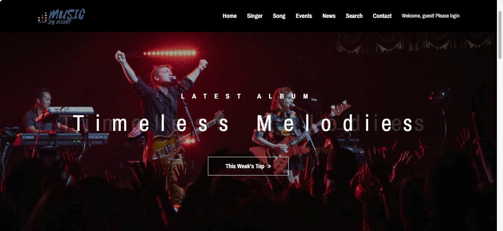</td>
    <td></td>
    <td></td>
  </tr>

  <tr>
    <th>All Music Displayed</th>
    <th>Song Details Page</th>
    <th>Singer Details Page</th>
  </tr>
  <tr>
    <td>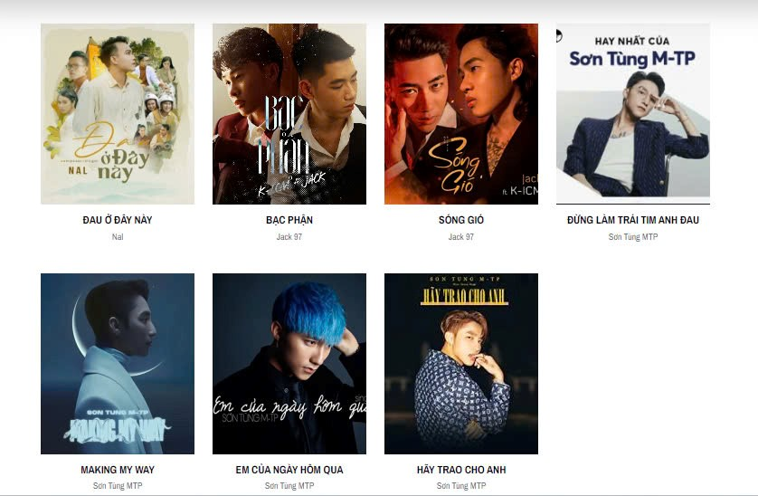</td>
    <td>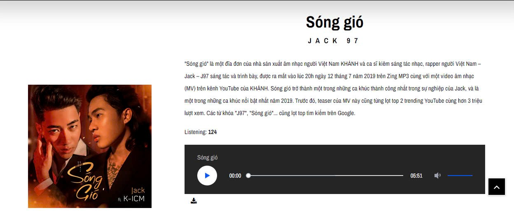</td>
    <td>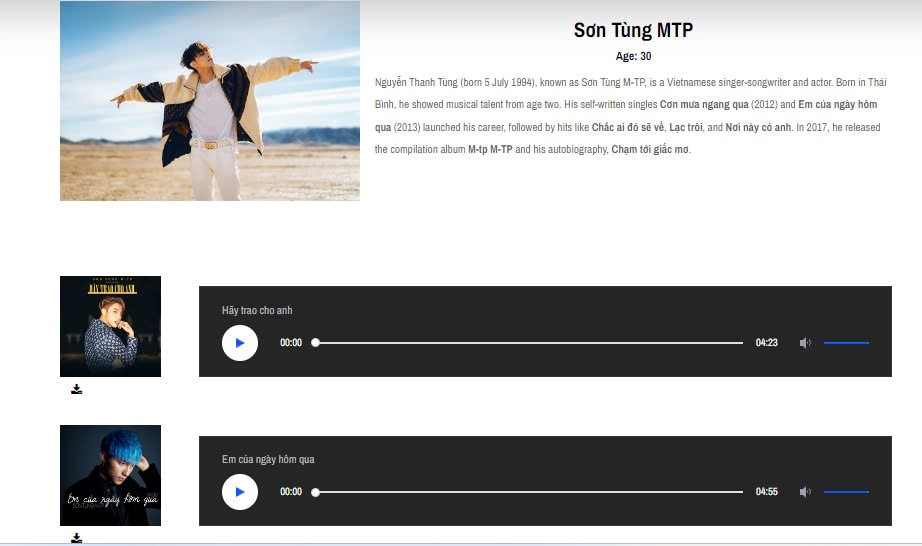</td>
  </tr>

  <tr>
    <th>Popular Artists</th>
    <th>Top 10 Songs</th>
    <th>Search Results</th>
  </tr>
  <tr>
    <td>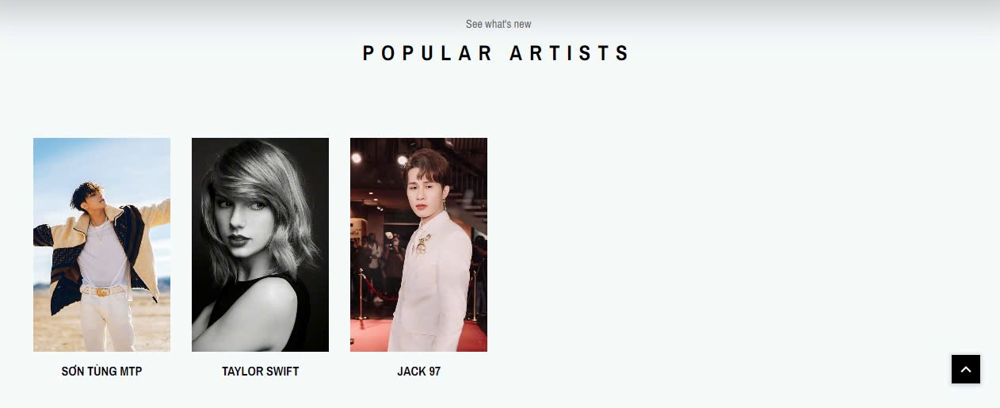</td>
    <td>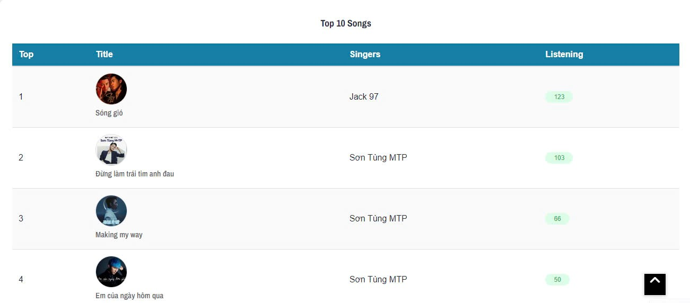</td>
    <td>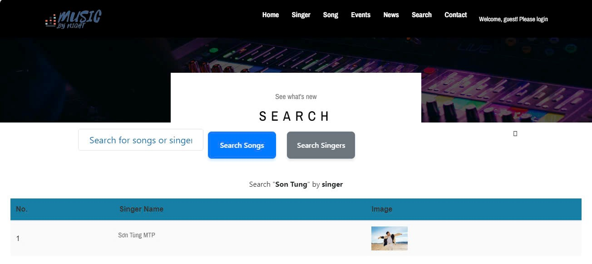</td>
  </tr>

  <tr>
    <th>Filter by First Letter</th>
    <th>Event Page</th>
    <th>News Page</th>
  </tr>
  <tr>
    <td>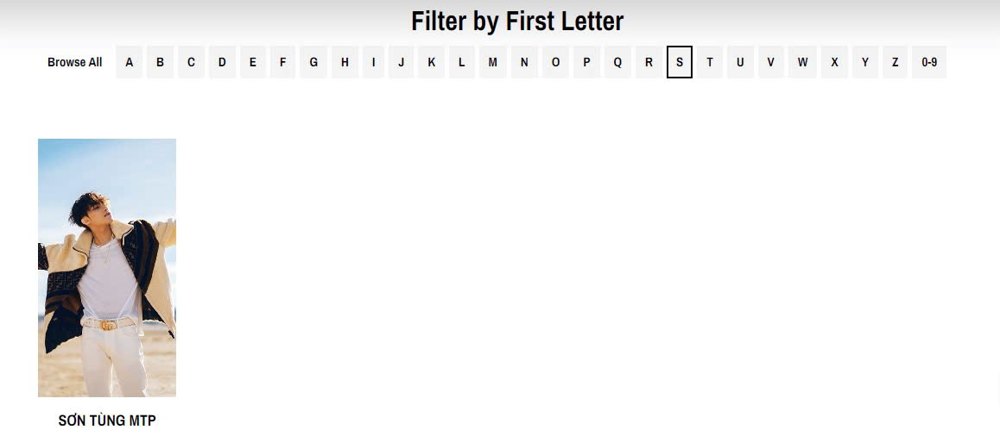</td>
    <td>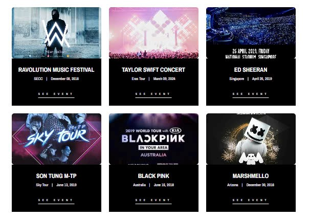</td>
    <td>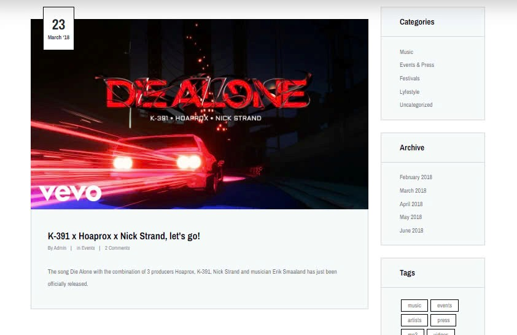</td>
  </tr>

  <tr>
    <th>Contact Page</th>
    <th>Mini Game (Quiz)</th>
    <th>Show All Singers Page</th>
  </tr>
  <tr>
    <td>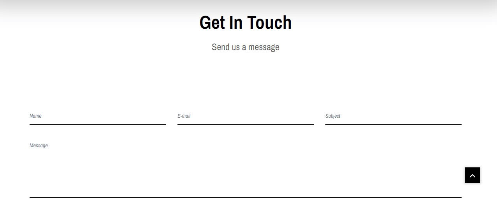</td>
    <td>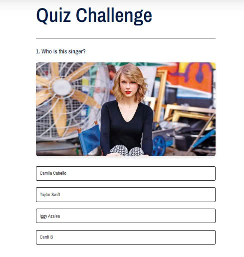</td>
    <td>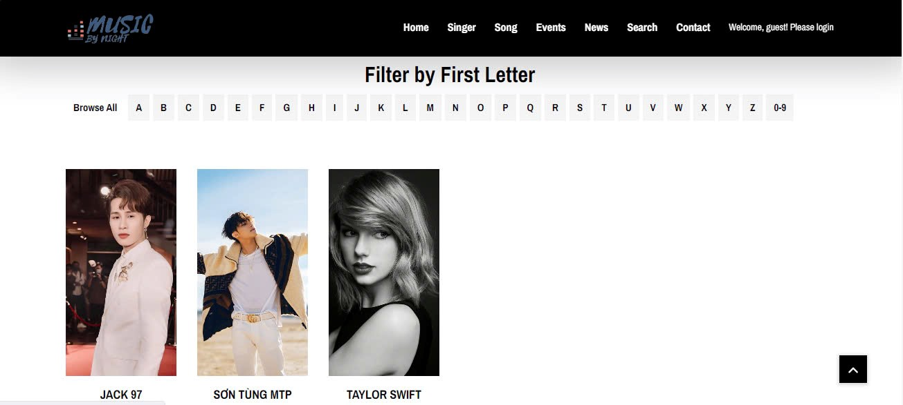</td>
  </tr>
</table>

<h3>🔧 Admin Interface</h3>

<table>
  <tr>
    <th width="33%">Dashboard Page</th>
    <th width="33%">Add Music Page</th>
    <th width="33%">Add Singer Page</th>
  </tr>
  <tr>
    <td>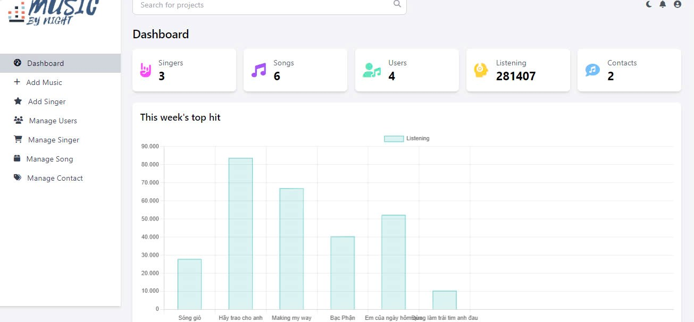</td>
    <td>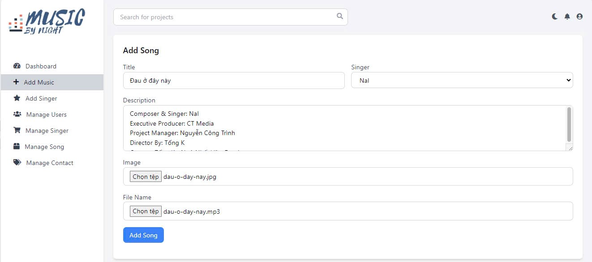</td>
    <td>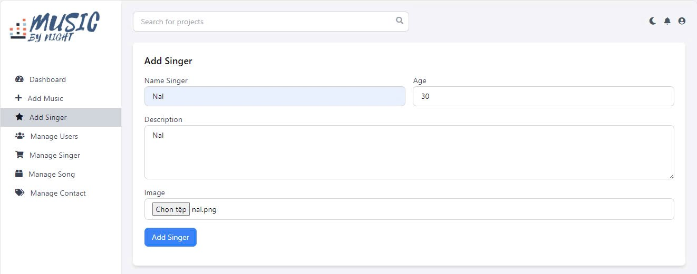</td>
  </tr>

  <tr>
    <th>Manage Singers</th>
    <th>Manage Songs</th>
    <th>Manage Users</th>
  </tr>
  <tr>
    <td>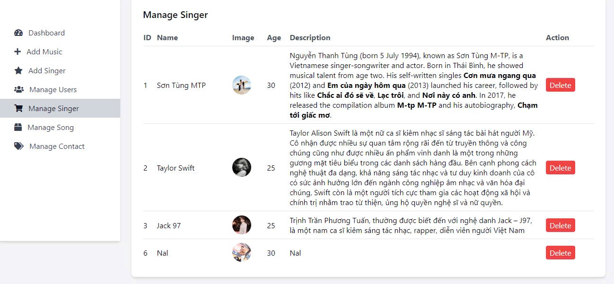</td>
    <td>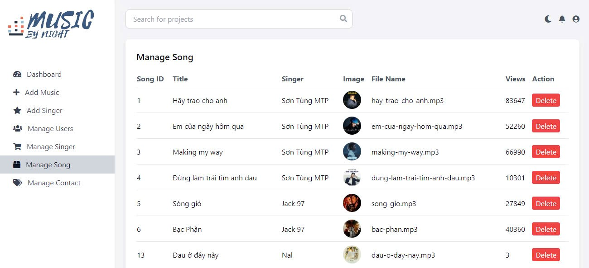</td>
    <td>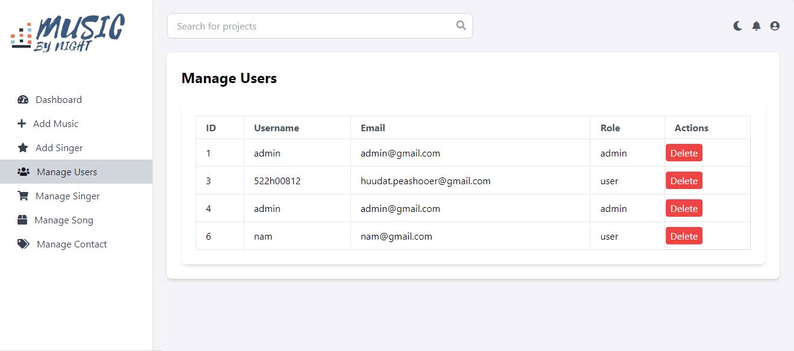</td>
  </tr>

  <tr>
    <th>Manage Contact</th>
    <th>Bar Chart (Data Visualization)</th>
    <th>Top 10 Songs (Admin View)</th>
  </tr>
  <tr>
    <td>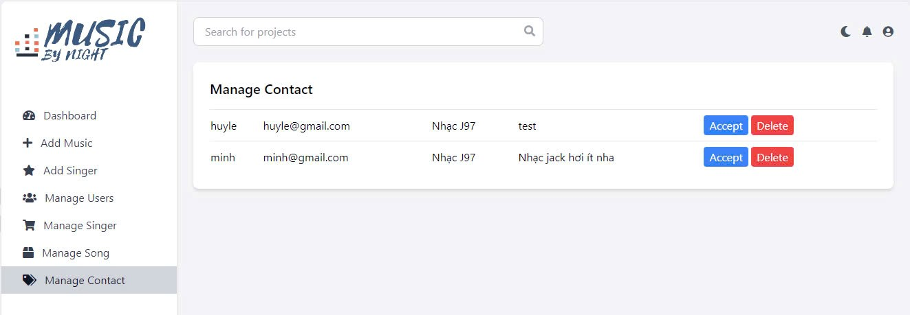</td>
    <td>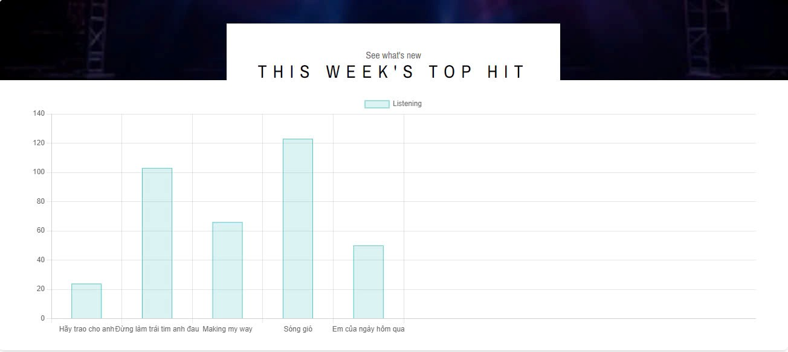</td>
    <td>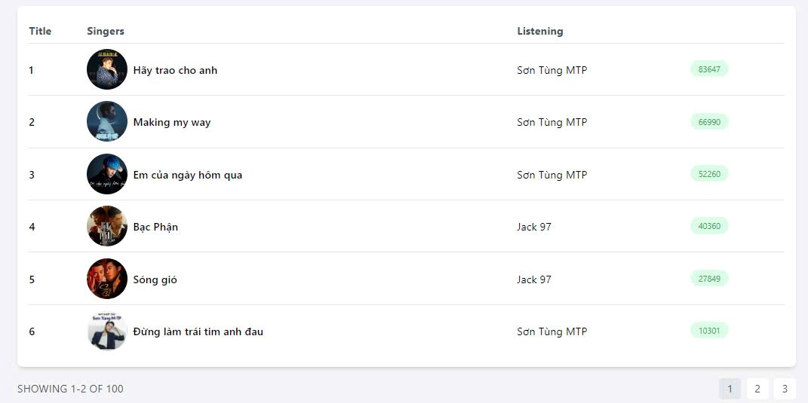</td>
  </tr>

  <tr>
    <th>Singer Added Confirmation</th>
    <th>Song Detail After Add Music</th>
    <th>User Deleted Confirmation</th>
  </tr>
  <tr>
    <td>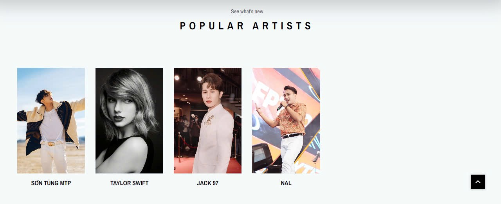</td>
    <td>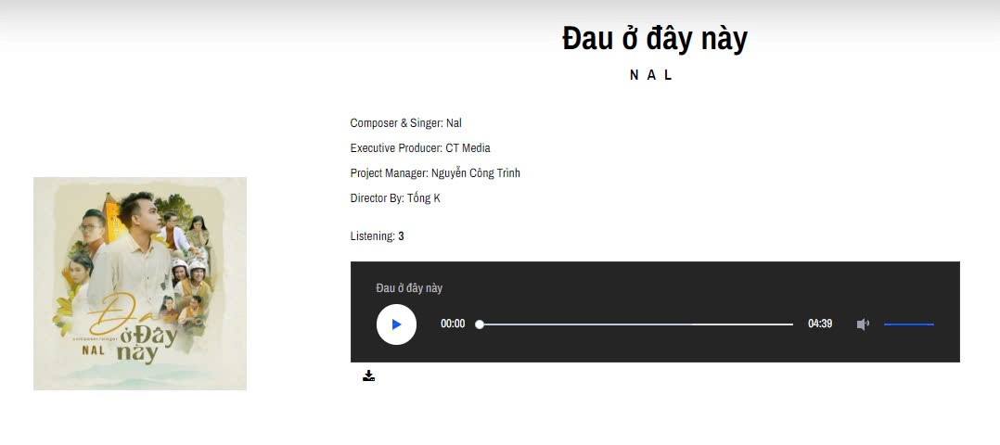</td>
    <td>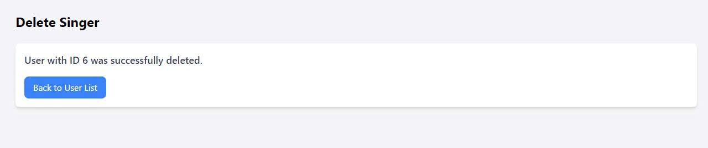</td>
  </tr>
</table>


## 💻 Technology Stack

*   **Frontend:** HTML5, CSS3, JavaScript
*   **Backend:** Java, Java Servlets
*   **Database:** MySQL
*   **Server:** Apache Tomcat (or any other Servlet container)
*   **Build Tool (Assumed):** Maven or Gradle

## 🚀 Setup and Installation

1.  **Prerequisites:**
    *   JDK (Java Development Kit) 11 or higher.
    *   Apache Maven (or Gradle).
    *   MySQL Server.
    *   Apache Tomcat (or other Servlet container).
2.  **Database Setup:**
    *   Create a MySQL database (e.g., `musicart`).
    *   Import the provided SQL schema (`musicart.sql` - *you would need to create this*) to set up the necessary tables.
    *   Configure database connection details (URL, username, password) in the appropriate Java configuration file (e.g., a `connectDB.java` or properties file).
3.  **Clone the Repository:**
    ```bash
    git clone [https://github.com/TranHuuDat2004/Music_WebJava.git]
    cd music-project
    ```
4.  **Build the Project:**
    *   If using Maven:
        ```bash
        mvn clean install
        ```
    *   This will produce a `.war` file in the `target/` directory.
5.  **Deploy:**
    *   Deploy the generated `.war` file to your Apache Tomcat server (e.g., by copying it to the `webapps` directory).
6.  **Access the Application:**
    *   Open your web browser and navigate to `http://localhost:8080/[your-app-context-name]` or `http://localhost:8080/[music-project]` (the context name is usually the name of the `.war` file without the extension).

## 💡 Usage

*   **Users:** Navigate through the site using the main menu. Search for music, play songs, view artist details, and engage with community features.
*   **Admin:** Log in with administrator credentials to access the admin dashboard and manage site content and users.

---

This README provides a comprehensive overview of the Music  application. Enjoy the music!